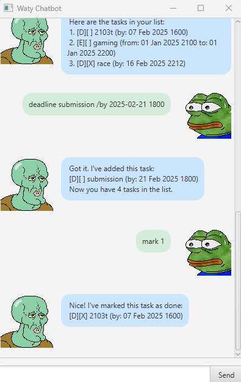

# Waty User Guide


## Introduction
Waty is a Personal Assistant Chatbot that helps you create and track different types
of tasks: ToDos, Deadlines and Events. Waty also allow you to search, sort and 
organise your tasks efficiently.

## Getting Started
To launch Waty, run this command in the terminal:
```
java -jar waty.jar
```

## Features
1. Add Tasks: Add ToDo, Deadline, or Event tasks.
2. Mark/ Unmark Tasks: Mark tasks as done or undone.
3. Delete Tasks: Remove tasks from the list.
4. Find Tasks: Search for tasks by keyword.
5. Sort Tasks: Arrange tasks chronologically by date.
6. Data Persistence: Automatically saves tasks to a .txt file and loads them upon startuo.
7. Error Handling: Shows errors with red-coloured messages when invalid commands are entered.

## Commands
| Command                                                               | Description                           |
|-----------------------------------------------------------------------|---------------------------------------|
| `todo [description]`                                               | Adds a ToDo task                      |
| `deadline [description] /by [yyyy-MM-dd HHmm]`                     | Adds a Deadline task                  |
| `event [description] /from [yyyy-MM-dd HHmm] /to [yyyy-MM-dd HHmm]` | Adds an Event task                    |
| `list`                                                                | Lists all tasks                       |
| `mark [task number]`                                                  | Marks a task as done                  |
| `unmark [task number]`                                                | Marks a task as not done              |
| `delete [task number]`                                                | Deletes a task                        |
| `find [keywords...]`                                                  | Finds tasks by keyword                |
| `sort`                                                                | Sort all tasks by chronological order |
| `bye`                                                                 | Exits the program                     |


## Requirements
Java 11 or higher

## File Management
Tasks are saved to a file named `waty.txt` in a `data` folder.  
You can delete this file to clear your tasks.